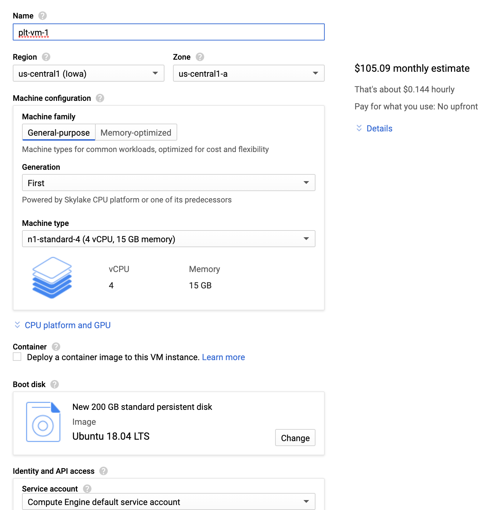

# COMS W4115: Programming Assignment 2.1 (Environment Setup 2)

## Course Summary

**Course:** COMS 4115 Programming Languages and Translators (Fall 2020)  
**Website:** https://www.rayb.info/fall2020  
**University:** Columbia University  
**Instructor:** [Prof. Baishakhi Ray](https://www.rayb.info/)

## Logistics
- **Announcement Date:** Wednesday, September 30, 2020
- **Due Date:** Monday, October 5, 2020 by 11:59 PM. **No extensions!**
- **Total Points:** 5

## Assignment

This assignment involves setting up your environment in preparation for future programming assignments. Here, we will create a virtual machine (optional) and set up LLVM.

### Creating a Virtual Machine (Optional)

If you do not have an environment or VM available for setting up LLVM, we suggest requesting for a virtual machine or setting up your own machine. Please choose exactly one of the following options if the previous statement applies to you.

#### Google Cloud VMs

We have allocated Google Cloud (GCloud) credits for each student. Please email or create a private Piazza post to the instructors/TAs expressing your interest in requesting for GCloud credits, and you will be sent a $100 GCloud coupon by email.

1. Follow these initial [instructions](http://www.cs.columbia.edu/crf/cloud-cs/) to redeem your course coupon.
2. Create a project for this class, and give it a name (_e.g._, "coms4115"). This will likely have to be created within the _columbia_ organization. 
3. Navigate to *Compute Engine* (while in the context of the new project), and create a virtual machine to match the specification shown below (you may select your own name). The most notable changes are:
	* Leave the region/zone to `us-central1` and `us-central1-a`.
	* Machine type: `n1-standard-4`
	* Click "change'' under boot disk to select `Ubuntu 18.04 LTS`, and add at least 120 GB of persistent hard disk (HDD).
	* Leave the defaults for the remaining options: `Compute Engine Default Service Account`, `Allow default access`, and `Unchecked boxes for Allow HTTP/HTTPS traffic`.
4. Upon creation of the VM, SSH into the machine by clicking the SSH button next to the instance in Compute Engine, or add your SSH keys to log in using your own terminal. More information on access can be found [here](https://cloud.google.com/compute/docs/instances/connecting-to-instance).

  

**IMPORTANT:** You must _shut down_ your instance when not in use. There are not enough credits to keep the server running continuously. Ensure it is shut down when not in use so that you do not lose credits unintentionally. There should be enough credits for about 850 hours of compute time.

Note that the GCloud VMs will have the same Ubuntu base image, and you can install necessary libraries on top of LLVM Clang in the future.

#### VMware Workstation/Oracle VirtualBox VMs

You may choose to use other open-source software to create your VMs. If you do so, please follow these steps:

* Create Ubuntu 18.04.3 Virtual Machine by using either VMware Workstation 15 Player or Oracle VM VirtualBox to install Ubuntu 18.04.3.
    - At least 8 GB memory is required for the virtual machine, and 12 GB memory is recommended.
    - At least 120 GB hard disk is required.
* Install the necessary packages (which can also be installed by running the `setup.sh` shell script we provide):
    - `sudo apt update`
    - `sudo apt upgrade`
    - `sudo apt install build-essential subversion cmake python3-dev`
    - `sudo apt install libncurses5-dev libxml2-dev libedit-dev swig`
    - `sudo apt install doxygen graphviz xz-utils git`

### Setting Up LLVM (5 Points)

LLVM provides compiler technologies designed for compile-time and runtime optimization. Clang is a C/C++ compiler front-end that leverages the LLVM back-end infrastructure. In this course, you will build new modules on top of the LLVM/Clang compiler framework.

You need to build LLVM and Clang by following the instructions found in the [LLVM/Clang website](http://clang.llvm.org/get_started.html). You can also run the `build-llvm.sh` shell script we have provided, which will execute all of the required commands for you.
* Build LLVM and Clang from the LLVM source in debug mode. Note that it may take a few hours for building to complete, so we recommend you do not complete this at the last minute.
* For this repository, we added the LLVM source from this [commit](https://github.com/llvm/llvm-project/tree/d1be928d23fe6b6770be007c7fd0753ca4d17516); you may use this reference for all future assignments.

Here is a <ins>**non-exhaustive list**</ins> of problems you might face during the setup process and how you would resolve them:

* If you face a problem with `cmake` version compatibility, refer to this [solution](https://askubuntu.com/a/829311/).
* Before building LLVM and Clang, add 8 GB of swap space in Ubuntu, as building LLVM and Clang will consume all of the memory. This [blog](https://linuxize.com/post/how-to-add-swap-space-on-ubuntu-18-04/) shows how to add swap space. Run `sudo swapoff -a` to first deactivate the swap space before creating the swap file.
* In case of out-of-memory issues during linking, add the `-DLLVM_USE_LINKER=gold` parameter in `cmake` to use the gold linker. The gold linker is faster and uses less memory.
* If there is any error during the building of LLVM and Clang, you can simply rerun `make` to perform an incremental build.

Finally, here are some valuable suggestions:
* Use `make -j <cores>` to take advantage of multiple CPU cores (_e.g._, `make -j 4` uses 4 cores). Keep in mind, however, that adding more cores may consume more memory.
* Feel free to play around (and familiarize yourself) with the [LLVM/Clang examples](http://clang.llvm.org/get_started.html#driver).

## Submission

For this programming assignment, please follow these steps for submission:

1. After building Clang and LLVM, rerun the `make` command.
2. Redirect the output of this command to a file called **_\<uni\>.txt_**. where **_\<uni\>_** is your Columbia UNI number. For example, if your UNI is *foobar123*, then your file will be called **_foobar123.txt_**. Make sure that the **_\<uni\>.txt_** file lives inside the top-level directory of the repository. We will be grading this file, and as long as you have successfully completed the build and redirected the output to this file, you will receive full credit.
3. Push this file to the remote repository on the master branch (assuming you have Git set up).

## Piazza

If you have any questions about this programming assignment, please post them in the Piazza forum for the course, and an instructor will reply to them as soon as possible. Any updates to the assignment itself will be available in Piazza.

## Disclaimer

This assignment belongs to Columbia University. It may be freely used for educational purposes.
